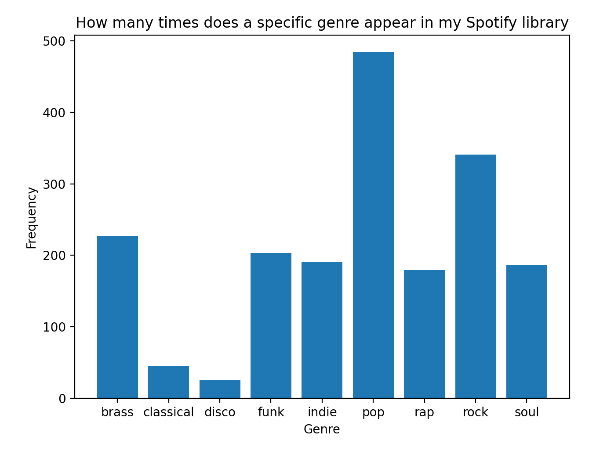

# HW_02 Data visualisation and Matplotlib practice

[Instructions for HW_02](https://github.com/mikeizbicki/cmc-csci040/tree/2021fall/hw_02)

## Idea for data analysis
As I was brainstorming ideas and running through databases for cool json and CSV datasets I came across this really cool website called [Organise Your Music](http://organizeyourmusic.playlistmachinery.com/index.html#). What it does is, it establishes a connection with your Spotify account and runs a script that collects information about what kind of genre music is in your libray as well as a multidue of different characteristics, such as energy, valence, danceability etc. about each song.

## Graph 1. What kind of music do I listen to mostly?

As you can see, pop music seems to dominate my library with rock following relatively close by. This is kinda funny because I thought that I didn't listen to too much pop music in my free time. However, this is not indicative of how much time I have actually listened to one genre or the other as I think disco and funk, although presented in much lesser numbers take up much more of my listening time than funk. This graph also doesn't look at the country of origin of the song or the language in which it is sung in. I can promise you, that it isn't predominantly English.

##Graph 2. 

